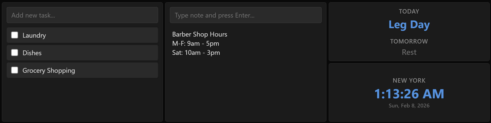

# Configuring

1. Copy `config-template.json` and rename to `config.json` 
2. Create a `modules` directory
3. Clone various info-panel modules into the `modules` directory you just created

# Running

Run the docker image with the following configuration:

1. Mount the `config.json` file to `/app/config.json`
2. Mount your `modules` directory to `/app/modules/`

Optionally, bind to a different port on the host

# Development

The following are convenience scripts to get up and running locally:

* `dev.bat` - Starts up a node environment to do interactive development
  (so you don't need to install node locally)
* `build.bat` - Builds the latest version of the docker image
* `run.bat` - Runs the docker image against this repository (assumes there is a `config.json` file
  and `modules/` directory both at the root)

---

A flexible, grid-based dashboard system designed for small displays (like 8.8" monitors). Features automatic live-reload when configuration changes are detected.

## Screenshot

Sample screenshot showcasing Info Panel Modules

Included (from left to right):
* [IPM Todo List](https://github.com/b-rad-dot-dev/ipm-todo-list)
* [IPM Notes](https://github.com/b-rad-dot-dev/ipm-notes)
* [IPM Cadence](https://github.com/b-rad-dot-dev/ipm-cadence)
* [IPM Clock](https://github.com/b-rad-dot-dev/ipm-clock)

## Features

- **Grid-based layout** - Define custom grid dimensions and place modules anywhere
- **Live reload** - Automatically updates when `config.json` is modified
- **Modular architecture** - Easy to add custom modules
- **Minimal design** - Optimized for small screen real estate
- **Local storage** - Data persists across sessions

## Installation

```bash
cd dashboard-app
npm install
```

## Running the Application

```bash
npm start
```

Or for development with auto-restart:

```bash
npm run dev
```

The dashboard will be available at `http://localhost:3000`

## Configuration

The dashboard is configured via `config.json` in the root directory. The application watches this file and automatically reloads the UI when changes are detected.

### Configuration Structure

```json
{
  "gridWidth": 4,
  "gridHeight": 3,
  "modules": [
    {
      "name": "module-name",
      "width": 1,
      "height": 1,
      "x": 0,
      "y": 0,
      "config": {}
    }
  ]
}
```

### Grid Properties

- `gridWidth` - Number of columns in the grid
- `gridHeight` - Number of rows in the grid

### Module Properties

- `name` - Module folder name (e.g., "todo-list", "notes")
- `width` - Number of grid columns the module spans
- `height` - Number of grid rows the module spans
- `x` - Starting column (0-indexed)
- `y` - Starting row (0-indexed)
- `config` - Module-specific configuration object

### Custom Config Path

Set a custom config file location via environment variable:

```bash
CONFIG_PATH=/path/to/my/config.json npm start
```